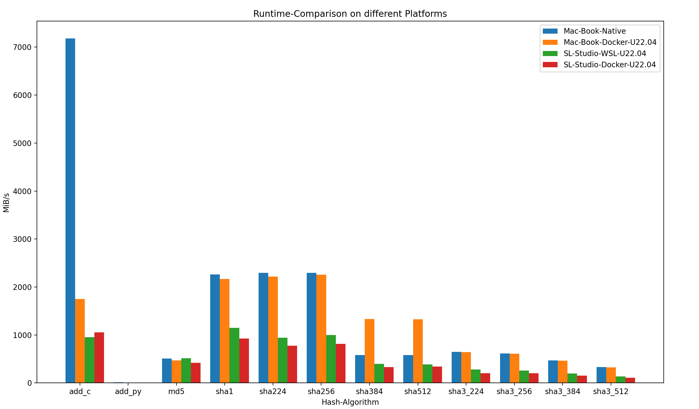

# Hash-Test

Test the Performance of different Hash-Functions.

## Build

### Install Docker on your Host

- Wikipedia: https://de.wikipedia.org/wiki/Docker_(Software)

### Build Docker-Image

```bash
$ docker build . -t hash-test
```

## Install & Run Hash-Test

```bash
$ docker run -ti --rm -h My-Computer-U22.04 hash-test bash
```
```bash
root@My-Computer-U22:~# make install
root@My-Computer-U22:~# make
```
```
Function      |         us | MiB/s | Hash
--------------------------------------------------------------------------------------------------------
add_c         |     293229 |  1746 | 7f7a1cdb
add_py        |   52203652 |     9 | 7f7a1cdb
ssl_md5       |    1047065 |   488 | db07715b267c331af68c30619862e53c
ssl_sha1      |     228334 |  2242 | 2a5ec16fa394184521fa30c715698559248620f5
ssl_sha224    |     225626 |  2269 | db39a578747876e28f3c2bc79f15840eb9559df07d3a085e1a2ceb90
ssl_sha256    |     225767 |  2267 | 1c25df47664bae1553c15e2dd6437f14794ffd9948ca816fc7078d59b8449e1c
ssl_sha384    |     384559 |  1331 | fb83bc09500228f47718889c1bdd7ac93fe9009d70de3af355d1c9aa95f906e5...
ssl_sha512    |     385211 |  1329 | 478af915363ef5feea0176d23ce6650b68656d68cfdccce94f7377b5e3d82ba7...
ssl_sha3_224  |     796652 |   642 | 54bf0e54e53009291178caa5bd2331c27f54c2efb5d5b0ec7613e3f0
ssl_sha3_256  |     841351 |   608 | 629a8fc8135a654e21a223952276e9e301f030f8e053db799eed309b2bd72eb3
ssl_sha3_384  |    1100015 |   465 | 41c8783146548dfa085b4c6f924496014025185490efd5c13dbba59e0d615858...
ssl_sha3_512  |    1575401 |   324 | 0a29a2c8756667f9091b8eec0f7b60b5f6e22ba36f87a5a68d45334ff47fae67...
ssl_shake_128 |     686325 |   746 | 652a15b3e75165286cc9d90def46aa8082a11cad49962e13e05ae16f1b6cf459
ssl_shake_256 |     840886 |   608 | 54e6379ca8dd2fad201a8c6bec3758102003d66d62a16ceb3bf2c8568c76d037
blake2b       |     590155 |   867 | 2ff25a8aa79f8ec887583923d68e51ce32d48e316b5babd88fe52efe7123ebaf...
blake2s       |     979613 |   522 | 4c62e37afbb2b0230edb92a94772f10da8ba45b784566c7a482b488534cd8356
--------------------------------------------------------------------------------------------------------
CSV for Analyis
--------------------------------------------------------------------------------------------------------
Computer;add_c;add_py;_md5;_sha1;_sha224;_sha256;_sha384;_sha512;_sha3_224;_sha3_256;_sha3_384;_sha3_512;_shake_128;_shake_256;blake2b;blake2s
My-Computer-U22;1746;9;488;2242;2269;2267;1331;1329;642;608;465;324;746;608;867;522
```

## Current Results



## Related All-Dings-Story

- Day-70 Hash-Functions: https://all-dings.github.io/111/23.html#7000
